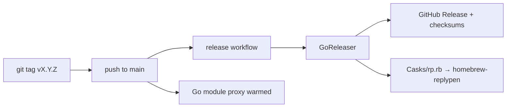

# replypen-cli (`rp`)

A scriptable client for **debugging replypen from your terminal** — trace a thread end to end, audit
triage decisions, list projects and threads, mint project tokens, decode Gmail/Outlook ids, and check
whether a domain can onboard — over replypen's `/api/v1/debug` API, authed with a **static bearer token**
you paste once with `rp login`. **Fat client, thin server:** the API returns raw, token-scoped data and
`rp` renders it as a table on a TTY or **JSON when piped**, so `| jq` always works. It replaces a pile of
replypen's Python debug scripts (`trace_thread.py`, `triage_logs.py`, `gmail_ids.py`, `onboard.py`, …)
with one binary.

```console
$ rp whoami
scope: admin (all projects)

$ rp thread trace 2451b0f2 --md --jsonl     # offline twin of the status page
.replypen/debug/2451b0f2-acme-support.md
.replypen/debug/2451b0f2-acme-support.jsonl

$ rp triage acme-support --limit 50 | jq '.decisions[] | select(.should_process|not) | .reason'
$ rp provider detect acme.com gmail.com     # can these domains onboard?
$ rp id gmail 18f2a1b9c4d5e6f7              # decode a Gmail id + build a web URL
```

## Install

You do **not** need Go installed — grab a prebuilt binary with the one-liner for your platform.

**macOS — Homebrew:**

```bash
brew install rootcause-org/replypen/rp     # then: brew upgrade rp
```

> This is a **cask** (a prebuilt binary), not a source formula — it sidesteps the Homebrew sandbox/PTY
> install that fails on some macOS setups with `can't get Master/Slave device`. Quarantine is stripped
> automatically, so `rp` runs without a Gatekeeper prompt. (The tap is `rootcause-org/replypen`, separate
> from the sibling `rc` tap, because a GitHub org can't host two repos of the same name.)

**Linux / WSL — install script** (no Homebrew or Go required):

```bash
curl -fsSL https://raw.githubusercontent.com/rootcause-org/replypen-cli/main/scripts/install.sh | sh
```

Detects your arch, installs `rp` to `/usr/local/bin` (or `~/.local/bin`), and is idempotent — re-run to
upgrade. Works on macOS too.

**Windows (native PowerShell):**

```powershell
irm https://raw.githubusercontent.com/rootcause-org/replypen-cli/main/scripts/install.ps1 | iex
```

Installs `rp.exe` and adds it to your user PATH. (On **WSL**, use the Linux one-liner above — WSL is
Linux.)

**From source (Go devs, any OS):**

```bash
go install github.com/rootcause-org/replypen-cli/cmd/rp@latest
```

### Upgrading

```bash
rp upgrade            # self-update to the latest release (Linux / WSL / Windows)
rp upgrade --check    # just say whether a newer version exists
brew upgrade rp       # macOS (Homebrew) — rp upgrade detects this and points you here
```

`rp upgrade` replaces its own binary with the latest release for your OS/arch (verifying the published
sha256 first). On a Homebrew install it defers to `brew upgrade rp` so it doesn't fight brew.

## Configure

`rp` carries a **static bearer token** — there's no OAuth and no login flow, you paste a token you were
given (a super-admin token, or a project-scoped `rpc_live_…` token). `rp login` stores it under a profile
in `~/.config/replypen/config.toml` (0600); every later command reads it:

```bash
rp login --token rpc_live_xxxxxxxx --base-url https://app.replypen.com
rp whoami            # asks the server which scope the token has
rp logout            # clear this profile's stored token
```

**Profiles** are the token-store keys — use `--profile` to keep more than one token (e.g. a project token
and an admin token, or staging vs prod):

```bash
rp login --profile admin --token <super-admin-token> --base-url https://app.replypen.com
rp projects --profile admin            # admin scope: all projects
rp login --token rpc_live_xxx --base-url https://app.replypen.com   # the "default" profile
```

**Environment variables** override the stored profile without touching the file — handy in CI:

```bash
export REPLYPEN_TOKEN=rpc_live_xxxxxxxx
export REPLYPEN_BASE_URL=https://app.replypen.com
rp threads acme-support
```

**Precedence.** Token: `--token` > `REPLYPEN_TOKEN` > stored profile. Base URL: `--base-url` >
`REPLYPEN_BASE_URL` > stored profile `base_url` > built-in default (`http://localhost:8080`, with a
stderr warning so piped output stays clean). A stored token pins the base URL it was logged in with, so
later commands hit the same server.

`config.toml` shape (the token store — keep it 0600, never commit it):

```toml
[default]
token = "rpc_live_xxxxxxxx"
base_url = "https://app.replypen.com"

[profiles.admin]
token = "super-admin-token"
base_url = "https://app.replypen.com"
```

## Commands

Global flags: `--profile <name>` picks the stored token; `--token` / `--base-url` override it;
`-o json|table` forces output (default: **table on a TTY, JSON when piped**).

### Debug — the everyday loop

```bash
# Who am I? (verifies the token end to end against the server)
rp whoami
rp whoami -o json | jq -r .scope

# Projects this token can see (all for admin, one for a project token)
rp projects
rp projects | jq '.projects[] | {slug, mailbox_count}'

# Recent threads for a project, newest first
rp threads acme-support --limit 30 --status webhook_sent
rp threads acme-support | jq '.threads[] | select(.status=="errored") | .id'

# Last N inbound threads + their triage decision (replaces triage_logs.py)
rp triage acme-support --limit 50
rp triage acme-support --csv > triage.csv          # spreadsheet-ready, any output mode
rp triage acme-support | jq '.decisions[] | select(.confidence < 0.6)'
```

### `rp thread trace` — the offline status page (replaces `trace_thread.py`)

Fetch the full assembled bundle for one thread and render its merged timeline. `<id>` is a replypen
thread **UUID** *or* an external/provider thread id (the server resolves either):

```bash
rp thread trace 2451b0f2-...-...                       # readable timeline table
rp thread trace 2451b0f2-...-... -o json | jq '.timeline'   # verbatim server bundle
rp thread trace AAMkAGI2...  --md --jsonl               # decompose to disk (external id works too)
#   .replypen/debug/2451b0f2-acme-support.md     ← thin index: header, outcome, timeline, jq recipes
#   .replypen/debug/2451b0f2-acme-support.jsonl  ← jq-able event log (line 1 = thread header)
rp thread trace 2451b0f2 --jsonl --out-dir /tmp/dbg
```

Then drill into the JSONL with your own jq — line 1 is the thread header (full triage/injection blobs),
every later line one timeline entry keyed by `type`:

```bash
jq -rc 'select(.type=="delivery")'                  .replypen/debug/2451b0f2-acme-support.jsonl
jq -r  'select(.type=="thread").triage_result'      .replypen/debug/2451b0f2-acme-support.jsonl
```

### Local helpers — no token, no network (beyond DNS)

```bash
# Can this domain onboard? google/microsoft = supported, anything else = not. (replaces detect.py)
rp provider detect acme.com
rp provider detect acme.com gmail.com user@contoso.com      # many at once
rp provider detect acme.com -o json | jq '.provider, .supported'

# Decode a Gmail id + build a clickable web URL (replaces gmail_ids.py)
rp id gmail 18f2a1b9c4d5e6f7
rp id gmail 1799435061387980919 --user 2                    # /u/2/ mailbox
rp id gmail 18f2a1b9c4d5e6f7 -o json | jq -r .web_url

# Classify an Outlook/Graph id + tell you which DB column matches (replaces outlook_ids.py)
rp id outlook AAMkAGI2...
rp id outlook AAMkAGI2... -o json | jq '{kind, match_column, match_value}'
```

### Onboarding wrappers (replaces `onboard.py`)

These wrap replypen's existing tenant/project/mailbox endpoints. `tenant register` uses the **admin
secret** (`--admin-secret` / `REPLYPEN_ADMIN_SECRET`); `project create` / `mailbox connect` carry the
**tenant API token** via `--token`:

```bash
# 1. Register a tenant (admin secret) → prints the tenant's api_token (shown once)
rp tenant register --codename acme --admin-secret "$REPLYPEN_ADMIN_SECRET"

# 2. Create its project (tenant token) → prints the webhook_secret (shown once)
rp project create --token <tenant-api-token> \
  --name "Acme Support" --webhook-url https://acme.example/replypen/webhook [--triage-model …]

# 3. Connect a mailbox → prints the oauth_url the operator opens to grant access
rp mailbox connect --token <tenant-api-token> \
  --slug acme-support --provider google --email support@acme.com
```

`--provider` is one of `google` | `microsoft` | `intercom`.

### Upgrade & version

```bash
rp upgrade [--check]
rp --version
rp help
```

Output auto-detects: **TTY → table, piped → JSON**. Force with `-o json` / `-o table`. API errors are
surfaced verbatim (`CODE: message`) with a non-zero exit.

## Auth & scopes

A bearer token resolves **server-side** into one of two scopes — there is no `--scope` flag, the token
*is* the scope:

| Scope | Token | Sees |
|---|---|---|
| **admin** | the server's super-admin token | **all** tenants/projects; can mint project tokens and trace any thread |
| **project** | a `rpc_live_…` token | **one** project; cross-project reads return `403 FORBIDDEN` |

Mint a project-scoped token **as admin** (the server shows it **once** and stores only its hash):

```bash
rp project mint-token acme-support --profile admin
#   project: acme-support
#   token:   rpc_live_xxxxxxxx          ← hand this to the project, store it now
```

Then the project logs in with that token and is automatically scoped to itself:

```bash
rp login --token rpc_live_xxxxxxxx --base-url https://app.replypen.com
rp whoami            # scope: project (acme-support)
rp threads acme-support
```

## Releasing

Use the script — it runs the quality gates and does the whole cycle the same way every time:

```bash
scripts/release.sh patch     # 0.1.0 -> 0.1.1   (also: minor | major | vX.Y.Z | --dry-run)
```

A release is **three things that must land together**, which is why a bare `git tag` isn't enough:

1. the **git tag** `vX.Y.Z` on `main`;
2. the **GitHub Release** + prebuilt binaries — the release workflow cross-compiles every OS/arch via
   [GoReleaser](https://goreleaser.com) and attaches archives + `checksums.txt`;
3. the **Go module proxy** ingesting the tag, so `go install …@latest` resolves the new version.

The script gates on `go build/vet/test`, refuses a dirty/behind checkout, tags + pushes, waits for the
binaries, then warms the proxy.

**Homebrew** is wired up: each release, GoReleaser commits an updated `Casks/rp.rb` **cask** to the public
[`rootcause-org/homebrew-replypen`](https://github.com/rootcause-org/homebrew-replypen) tap (the
`homebrew_casks:` block in [`.goreleaser.yaml`](.goreleaser.yaml)), authenticating with the
`HOMEBREW_TAP_GITHUB_TOKEN` repo secret. It's a **cask** (prebuilt binary), not a source **formula**, on
purpose — a non-bottled formula installs through a Homebrew sandbox + Ruby PTY that fails on some macOS
setups. Linux/WSL/Windows install via [`scripts/install.sh`](scripts/install.sh) and
[`scripts/install.ps1`](scripts/install.ps1), which need no Homebrew.



See [`SKILL.md`](SKILL.md) for the architecture and how to add a command, and
[`AGENTS.md`](AGENTS.md) for the router + scope guards.
